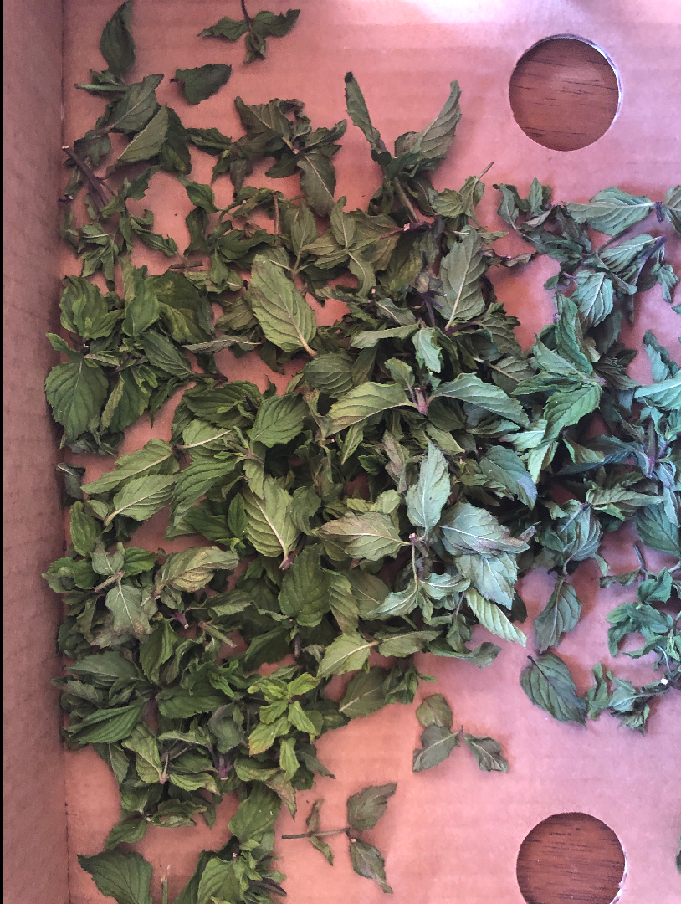
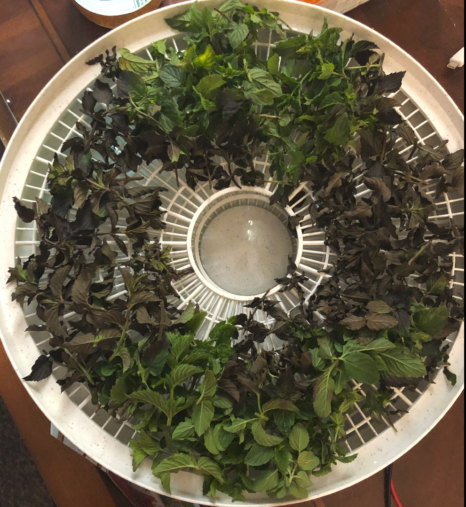
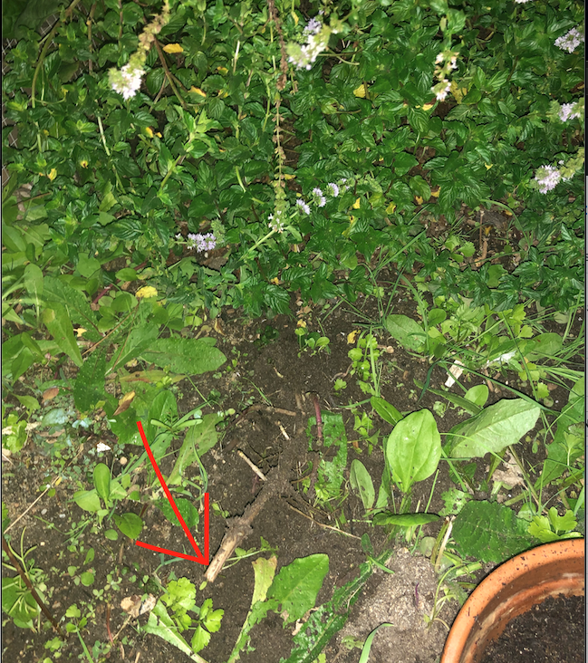

# Homemade Organic Mint Tea

Spearmint grows like crazy in my organic garden (see below), so I have to cut some to yield space for my zucchini. Here are some of my notes and lessons I learned from making spearmint tea. For those who know how to homebrew tea, please feel free to create a pull request to fix my steps.

I collect a handsome amount of the good-looking leaves from the shrub. Although fresh mint can be tossed into boiling water to make a good cup of tea, I want to dry them for preservation. After washing the leaves, I try to dry them at room temperature. It takes around 2 days for the leaves to dry (not completely, some are still soft). 

I found the natural dried mint leaves do not look like *tea*: they are hard and solid. I have a food dehydrator for making beef jerky. Maybe it can also dry the spearmint.

After 10 minutes:

Another 15 minutes bring almost all leaves a completely dry. The leaves turn brown. I was afraid the machine dried leaves will be fragile, but it turns out to be okay. 

This [tutorial](https://www.thespruceeats.com/make-your-own-dried-mint-1706225) says baking in oven at 180F for 2-4 hours will also work. I have not try, but if you do not have a food dehydrator, perhaps oven is the way to go. Drying them at room temperature takes days.

The mint tea is a success. Note that there are too much refreshing smell coming out from the food dehydrator, which does not make me feel very good. I have to put on my respirator (3M 2297 filters will do the job).

## Mint is soooo invasive

The harmless-looking mint has become a problem - it spreads so fast. 

The brown rhizomes spread on or just beneath the ground. The white rhizomes dive approximately 10 inches under the ground in all directions, making them very hard to discover and remove. Little mints grow out of these rhizomes. I believe they all have the potential to become a huge shrub if I leave them alone for a little while.

Here is a picture of the white rhizome I digged out.

