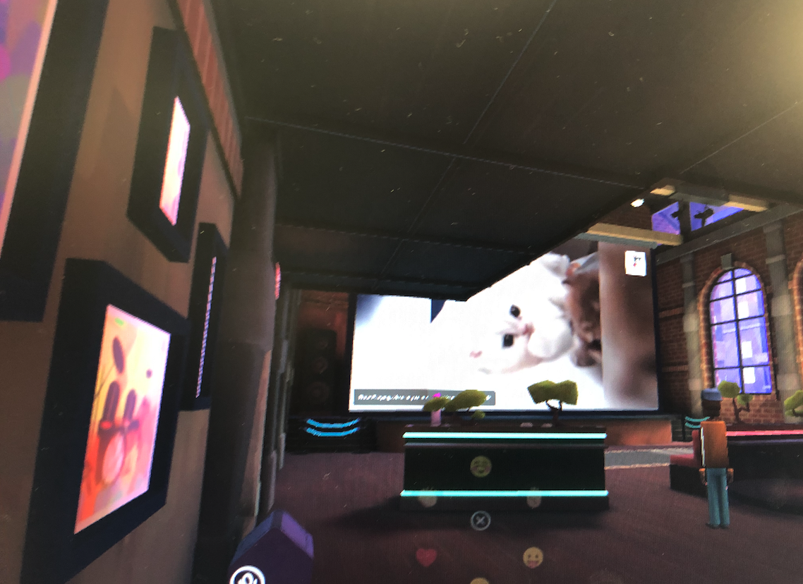
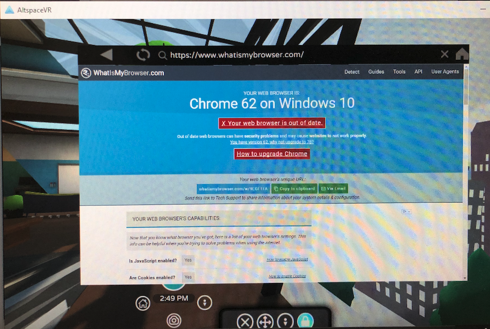

# The outdated and vulnerable browser in Virtual Reality games

My labmate works hard to address the safety issues in the Virtual Reality world. Out of curiosity I looked at one of the popular VR social game, AltspaceVR. In the VR world, there are virtual theaters and virtual TVs - you can watch YouTube videos through the eye of the avatars.

The game even embeds a browser, which can be launched into the virtual space. Then, to my surprise, I found out the browser is a two years old Chrome 62, originally released in 2017/10. Almost all the bugs we learned from our WebGL bugs study can exploit this out-dated browser. I haven't try to run our PoCs, but it is easy to imagine missing this amount of patches means a lot of web app privilege escalations, crashes, and kernel panics can happen. You should only load trustworthy websites in the VR browsers.

